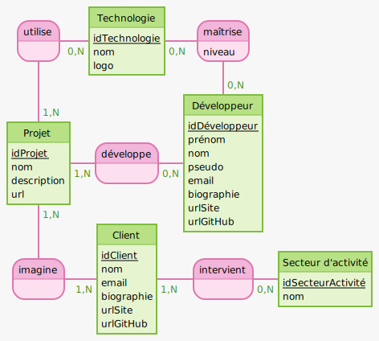
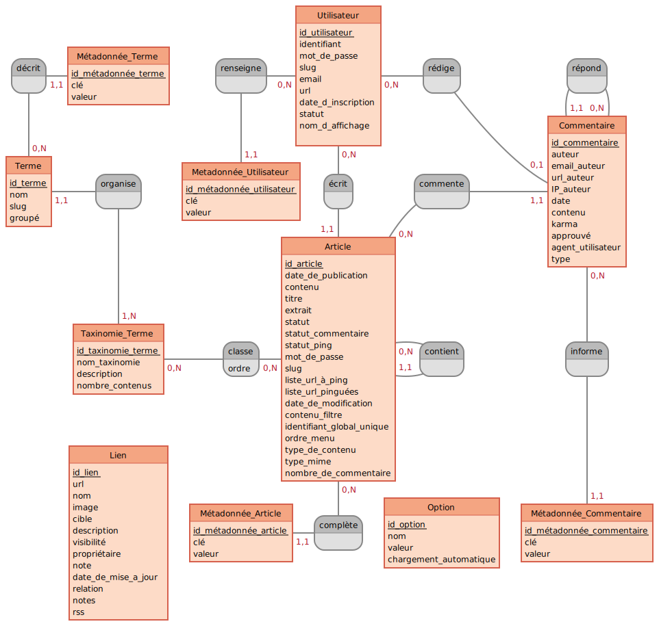

# Gestion des données avec WordPress

## Modèle conceptuel de données (MCD)

### oProfile

### WordPress

[Voir le diagramme EER MySQL](wordpress-eer.png)

---

## Entités

Nom|Table WordPress|Détail(s)
-|-|-
Client|`posts`|type `customer`
Développeur|`users`|rôle `developer`
Projet|`posts`|type `project`
Secteur d'activité|`terms`|taxonomy `activity_area`
Technologie|`terms`|taxonomy `technology`

---

## Propriétés (Attributs)

### Client

Propriété|Table WordPress|Colonne|Détail(s)
-|-|-|-
idClient|`posts`|`ID`|
nom|`posts`|`post_title`|
email|`postmeta`|`meta_value`|`meta_key` = `email`
biographie|`postmeta`|`meta_value`|`meta_key` = `description`
urlSite|`postmeta`|`meta_value`|`meta_key` = `url`
urlGitHub|`postmeta`|`meta_value`|`meta_key` =  `github_url`

### Développeur

Propriété|Table WordPress|Colonne|Détail(s)
-|-|-|-
idDéveloppeur|`users`|ID|
prénom|`usermeta`|`meta_value`|`meta_key` = `first_name`
nom|`usermeta`|`meta_value`|`meta_key` = `last_name`
pseudo|`usermeta`|`meta_value`|`meta_key` = `nickname`
email|`users`|`user_email`|
biographie|`usermeta`|`meta_value`|`meta_key` = `description`
urlSite|`users`|`user_url`|
urlGitHub|`usermeta`|`meta_value`|`meta_key` = `github_url`

### Projet

Propriété|Table WordPress|Colonne|Détail(s)
-|-|-|-
idProjet|`posts`|`ID`|
nom|`posts`|`post_title`|
description|`posts`|`post_content`|
url|`postmeta`|`meta_value`|`meta_key` = `url`

### Secteur d'activité

Propriété|Table WordPress|Colonne|Détail(s)
-|-|-|-
idSecteurActivite|`terms`|`term_id`|
nom|`terms`|`name`|

### Technologie

Propriété|Table WordPress|Colonne|Détail(s)
-|-|-|-
idTechnologie|`terms`|`term_id`|
nom|`terms`|`name`|
logo|`termmeta`|`meta_value`|`meta_key` = `logo`

---

## Associations

Entité 1|Nom|Entité 2|Table WordPress|Colonne entité 1|Colonne entité 2|Détail(s)
-|-|-|-|-|-|-
Client|invervient|Secteur d'activité|`term_relationships`|`object_id`|`term_taxonomy_id`|
Client|imagine|Projet|`postmeta`|`object_id`|`meta_value`|`meta_key` = `client_id`
Développeur|développe|Projet|`posts`|`ID`|`post_author`|
Développeur|maîtrise|Technologie|`developer_technology_relationships`|`developer_id`|`technology_id`|**Table personnalisée**
Projet|utilise|Technologie|`term_relationships`|`object_id`|`term_taxonomy_id`|

Si le développeur crée un projet, il en sera l'auteur.

Les clients associés au projet seront dans la table `postmeta` avec la `meta_key` `client_id`.

---

## Propriétés (Attributs) d'association

Entité 1|Nom|Entité 2|Table|Colonne|Détail(s)
-|-|-|-|-|-
Développeur|maîtrise|Technologie|`developer_technology_relationships`|`level`|Valeurs possibles : Débutant, Confirmé, Expert
